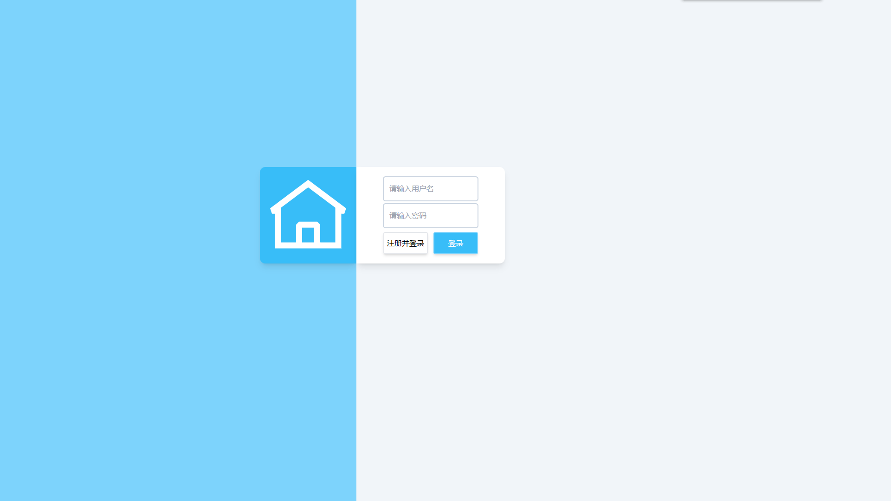
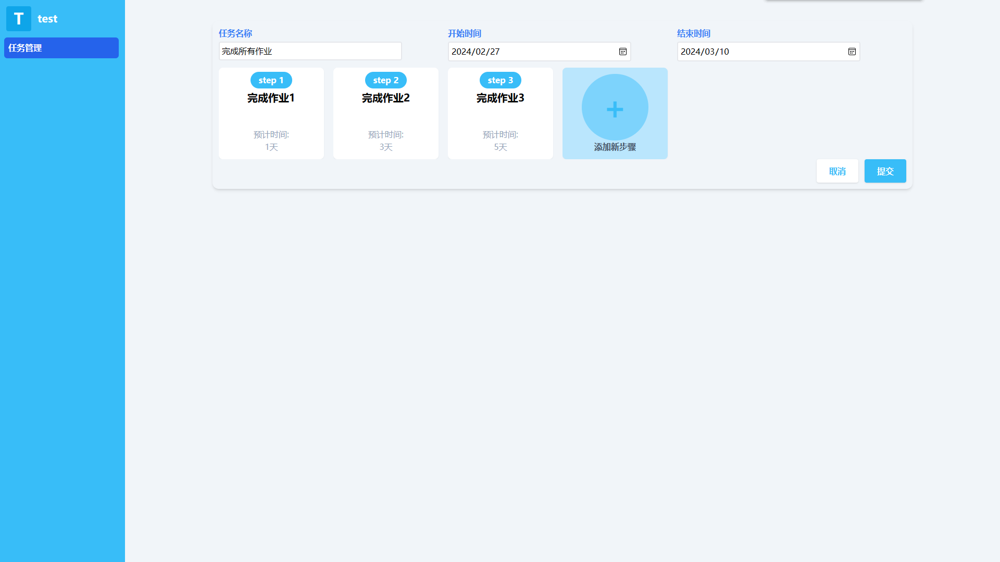
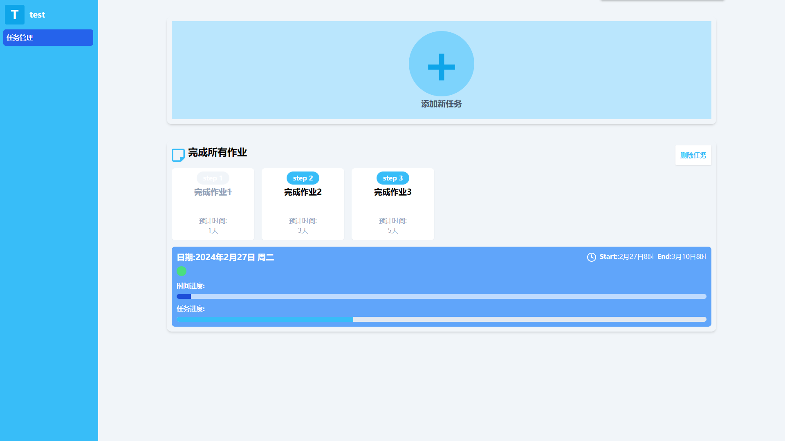

# 个人任务管理系统

任务管理系统，方便用户规划自己的日程安排

## 页面展示







## 项目启动

> 在启动项目前 请先在本地部署好后端服务器

> 后端地址:https://github.com/zzKati/DailyJob-server

将项目克隆到本地

### 开发

将代码克隆到本地后

```sh
# 安装项目依赖
npm install
```

```sh
# 以开发模式运行
npm run dev
```

### 部署

```sh
# 安装项目依赖
npm install
```

```sh
# 打包项目
npm run build
```

## 项目简介

本项目使用 `React`、`TypeScript`、`tailwindcss` 作为技术栈，基于 `vite`，

## 项目特点

-   类型严格

    项目中对类型的规范较严格，且使用 TS 工具帮助类型推断，禁止使用 any 等模糊类型，减少开发和维护的成本。

-   UI 美观

    对 UI 进行了精美的设计，统一 UI 风格，提升用户的交互感。

-   封装组件

    自主开发并封装 confirm、Loading 组件，减少用户对等待的感知，提升用户的体验。

-   体积较小

    使用`tailwindcss`有效优化项目体积。
